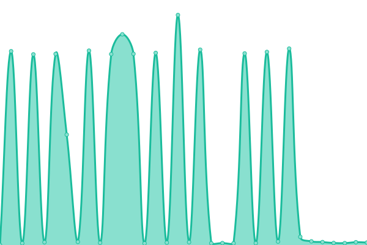

# [📈 Live Status](https://grupojorada.github.io/upptimejn): <!--live status--> **🟥 Complete outage**

This repository contains the open-source uptime monitor and status page for [grupojorada](https://grupojorada.github.io/upptimejn), powered by [Upptime](https://github.com/upptime/upptime).

With [Upptime](https://upptime.js.org), you can get your own unlimited and free uptime monitor and status page, powered entirely by a GitHub repository. We use [Issues](https://github.com/grupojorada/upptimejn/issues) as incident reports, [Actions](https://github.com/grupojorada/upptimejn/actions) as uptime monitors, and [Pages](https://grupojorada.github.io/upptimejn) for the status page.

<!--start: status pages-->
<!-- This summary is generated by Upptime (https://github.com/upptime/upptime) -->
<!-- Do not edit this manually, your changes will be overwritten -->
<!-- prettier-ignore -->
| URL | Status | History | Response Time | Uptime |
| --- | ------ | ------- | ------------- | ------ |
|  [JoradaNet](https://jorada.net) | 🟥 Down | [jorada-net.yml](https://github.com/grupojorada/upptimejn/commits/HEAD/history/jorada-net.yml) | 

 13512ms
     
 | 

<a href="https://grupojorada.github.io/upptimejn/history/jorada-net">42.39%</a>
    

|  [JoradaCom](https://jorada.com) | 🟥 Down | [jorada-com.yml](https://github.com/grupojorada/upptimejn/commits/HEAD/history/jorada-com.yml) | 

 11509ms
     
 | 

<a href="https://grupojorada.github.io/upptimejn/history/jorada-com">44.86%</a>
    

|  [JoradaOrg](https://jorada.org) | 🟥 Down | [jorada-org.yml](https://github.com/grupojorada/upptimejn/commits/HEAD/history/jorada-org.yml) | 

 10148ms
     
 | 

<a href="https://grupojorada.github.io/upptimejn/history/jorada-org">47.08%</a>
    

<!--end: status pages-->

[**Visit our status website →**](https://grupojorada.github.io/upptimejn)

## 📄 License

- Powered by: [Upptime](https://github.com/upptime/upptime)
- Code: [MIT](./LICENSE) © [grupojorada](https://grupojorada.github.io/upptimejn)
- Data in the `./history` directory: [Open Database License](https://opendatacommons.org/licenses/odbl/1-0/)
